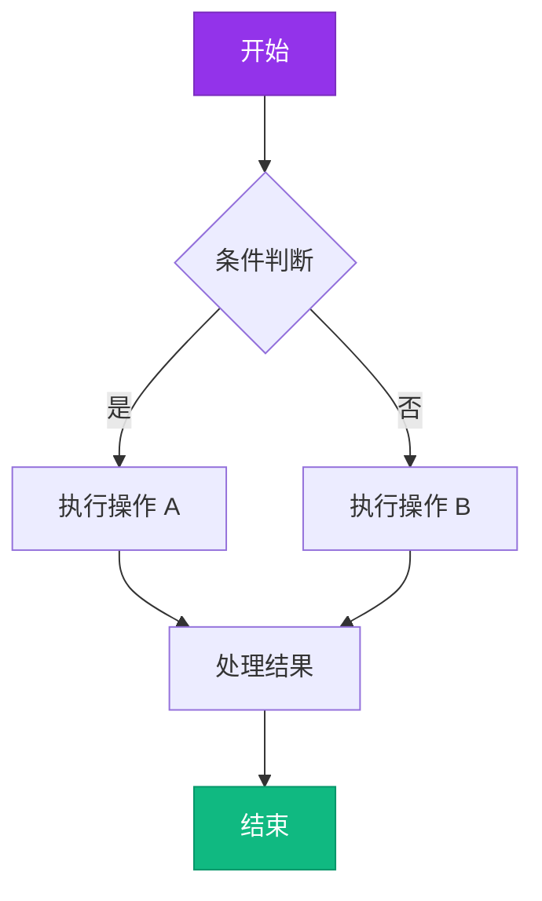
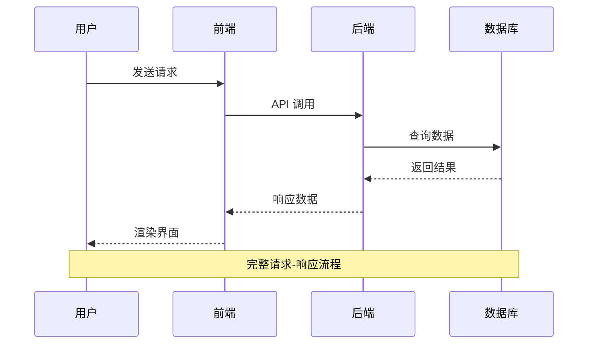
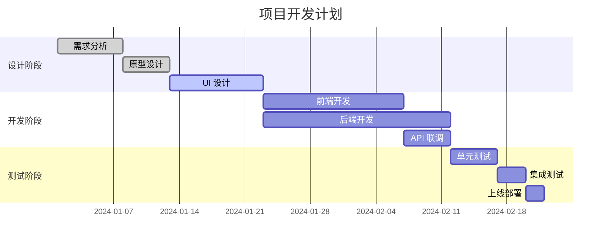

# Markdown 全结构验证文件

> 本文件覆盖 Murasaki 支持的所有 Markdown 语法结构，用于人工验证渲染效果。

## 1. 标题层级

# H1 一级标题

## H2 二级标题

### H3 三级标题

#### H4 四级标题

##### H5 五级标题

###### H6 六级标题

## 2. 文本格式

**粗体文本**

*斜体文本*

***粗斜体***

~~删除线~~

==标记文本==

++插入文本++

H~2~O 下标

X^2^ 上标

`行内代码`

> 这是引用块
> 第二行引用
>
> > 嵌套引用块

## 3. 列表

### 3.1 无序列表

- 列表项 1
- 列表项 2
  - 嵌套项 2.1
  - 嵌套项 2.2
    - 三层嵌套
- 列表项 3

### 3.2 有序列表

1. 第一项
2. 第二项
   1. 嵌套 2.1
   2. 嵌套 2.2
3. 第三项

### 3.3 任务列表

- [x] 已完成任务
- [ ] 未完成任务
- [x] 另一个已完成
- [ ] 另一个未完成

## 4. 代码块

### 4.1 行内代码

使用 `npm install` 安装依赖，`npm run dev` 启动开发。

### 4.2 普通代码块

```
这是普通代码块
没有语言标识
多行文本
```

### 4.3 带语法高亮的代码块

```typescript
interface User {
  id: number;
  name: string;
  email?: string;
}

class UserService {
  private users: Map<number, User> = new Map();

  async getUser(id: number): Promise<User | null> {
    return this.users.get(id) ?? null;
  }

  createUser(data: Omit<User, "id">): User {
    const id = Date.now();
    const user = { ...data, id };
    this.users.set(id, user);
    return user;
  }
}
```

```python
def fibonacci(n: int) -> list[int]:
    """生成斐波那契数列"""
    if n <= 0:
        return []
    if n == 1:
        return [0]
    
    result = [0, 1]
    for i in range(2, n):
        result.append(result[i-1] + result[i-2])
    return result


# 使用示例
for num in fibonacci(10):
    print(num, end=" ")
```

```rust
use std::collections::HashMap;

fn main() {
    let mut scores: HashMap<String, i32> = HashMap::new();
    
    scores.insert(String::from("Alice"), 10);
    scores.insert(String::from("Bob"), 20);
    
    for (name, score) in &scores {
        println!("{name}: {score}");
    }
}
```

```sql
SELECT 
    u.id,
    u.name,
    COUNT(o.id) AS order_count,
    SUM(o.total) AS total_spent
FROM users u
LEFT JOIN orders o ON u.id = o.user_id
WHERE u.created_at >= '2024-01-01'
GROUP BY u.id, u.name
HAVING COUNT(o.id) > 0
ORDER BY total_spent DESC
LIMIT 10;
```

```bash
#!/bin/bash
# 部署脚本示例

set -euo pipefail

APP_NAME="murasaki"
VERSION="${1:-latest}"

echo "部署 $APP_NAME 版本 $VERSION"

docker build -t "$APP_NAME:$VERSION" .
docker push "$APP_NAME:$VERSION"

kubectl set image deployment/"$APP_NAME" \
    app="$APP_NAME:$VERSION" \
    --namespace=production
```

## 5. 表格

### 5.1 基本表格

| 姓名 | 年龄 | 城市 | 职业 |
|------|------|------|------|
| 张三 | 28 | 北京 | 工程师 |
| 李四 | 32 | 上海 | 设计师 |
| 王五 | 25 | 深圳 | 产品经理 |

### 5.2 对齐表格

| 左对齐 | 居中对齐 | 右对齐 |
|:-------|:--------:|-------:|
| Left   | Center   |  Right |
| 左     | 中       |    右 |
| L      | C        |      R |

### 5.3 多列表格（合并单元格）

| 标题 1 | 标题 2 || 标题 3 |
|--------|--------||--------|
| A      | B      | C      |
| D      | E      | F      |

## 6. 链接

### 6.1 行内链接

[外部链接 - GitHub](https://github.com)

[带标题的链接](https://www.google.com "Google 首页")

### 6.2 引用链接

[引用链接][ref]

[ref]: https://www.example.com "引用链接示例"

### 6.3 自动链接

<https://www.example.com>

<user@example.com>

### 6.4 内部链接

[跳转到标题层级](#1-标题层级)

[跳转到代码块](#4-代码块)

## 7. 图片

### 7.1 行内图片


### 7.2 带标题的图片


### 7.3 图片链接

[](https://github.com)

## 8. 引用块

> 简单引用块

> 多行引用块
> 
> 第二段
> 
> > 嵌套引用
> >
> > 嵌套第二行

> ## 引用中的标题
> 
> 引用中的 **粗体** 和 *斜体*
> 
> - 引用中的列表项 1
> - 引用中的列表项 2

## 9. 数学公式

### 9.1 行内公式

质能方程 $E = mc^2$ 是爱因斯坦的著名公式。

欧拉公式 $e^{i\pi} + 1 = 0$ 被称为最美的数学公式。

### 9.2 块级公式

$$
\int_{-\infty}^{\infty} e^{-x^2} dx = \sqrt{\pi}
$$

$$
\sum_{n=1}^{\infty} \frac{1}{n^2} = \frac{\pi^2}{6}
$$

$$
\frac{\partial f}{\partial x} = \lim_{h \to 0} \frac{f(x+h) - f(x)}{h}
$$

$$
\begin{bmatrix}
a & b \\
c & d
\end{bmatrix}
\begin{bmatrix}
x \\
y
\end{bmatrix}
=
\begin{bmatrix}
ax + by \\
cx + dy
\end{bmatrix}
$$

## 10. Mermaid 图表

### 10.1 流程图



### 10.2 时序图



### 10.3 甘特图



## 11. 脚注

这是一个带脚注的文本[^1]，另一个脚注[^2]。

[^1]: 脚注的第一条内容。

[^2]: 脚注的第二条内容，可以包含 **格式化** 文本。

## 12. 定义列表

Markdown
:   一种轻量级标记语言

CodeMirror
:   浏览器端代码编辑器

Tauri
:   基于 Rust 的桌面应用框架

## 13. 缩写

HTML 是一种标记语言。

*[HTML]: HyperText Markup Language

CSS 用于样式控制。

*[CSS]: Cascading Style Sheets

## 14. Emoji

### 14.1 直接 Emoji

😀笑脸 🚀火箭 ❤️爱心 ⭐星星

### 14.2 短代码 Emoji

:smile: :rocket: :heart: :star: :thumbsup: :tada: :fire: :100:

## 15. HTML 内嵌

<details>
<summary>点击展开详情</summary>

这是折叠的内容块。

- 可以包含列表
- **粗体** 文本
- `行内代码`

</details>

<kbd>Ctrl</kbd> + <kbd>S</kbd> 保存

<mark>高亮标记文本</mark>

## 16. 分隔线

---

***

___

## 17. 混合嵌套结构

### 17.1 列表中的代码块

1. 打开终端
2. 执行以下命令：

   ```bash
   npm install
   npm run dev
   ```

3. 在浏览器中打开 `http://localhost:5173`

### 17.2 引用中的列表

> 项目特点：
> 
> - 轻量级
> - 跨平台
> - 高性能
> 
> 详见 [文档](#)。

### 17.3 表格中的格式

| 功能 | 快捷键 | 说明 |
|------|--------|------|
| 保存 | `Ctrl+S` | **强制保存** |
| 查找 | `Ctrl+F` | 支持 *正则* |
| 替换 | `Ctrl+H` | ~~仅限 Pro~~ |

### 17.4 任务列表嵌套

- [x] 完成需求分析
  - [x] 用户调研
  - [x] 竞品分析
- [ ] 开发阶段
  - [x] 前端搭建
  - [ ] 后端 API
  - [ ] 数据库设计
- [ ] 测试阶段

## 18. 特殊字符

### 18.1 转义字符

\*这不是斜体\*

\#这不是标题

\`这不是代码`

\[这不是链接\]

### 18.2 特殊符号

© 版权符号

® 注册商标

™ 商标符号

€ 欧元符号

¥ 人民币符号

°C 摄氏度

→ 箭头

≤ 小于等于

≥ 大于等于

≠ 不等于

∞ 无穷

## 19. 长文本段落

这是一段较长的文本，用于测试段落的折行和排版效果。Markdown 中的段落由空行分隔，连续的文本行会被合并为一个段落。在 Murasaki 编辑器中，软折行模式下文本会根据窗口宽度自动换行，而在硬折行模式下则会保留原始换行符。这段文本包含了中英文混排的内容，用于测试字体渲染和间距处理。The quick brown fox jumps over the lazy dog. Lorem ipsum dolor sit amet, consectetur adipiscing elit. Sed do eiusmod tempor incididunt ut labore et dolore magna aliqua. Ut enim ad minim veniam, quis nostrud exercitation ullamco laboris nisi ut aliquip ex ea commodo consequat.

## 20. 综合测试

> **注意**
> 
> 本文件覆盖了 Murasaki 支持的所有 Markdown 结构。如果在渲染中发现任何异常，请记录：
> 
> 1. 对应的章节编号
> 2. 期望的渲染效果
> 3. 实际的渲染效果
> 4. 截图（如可能）

---

*文件结束*
